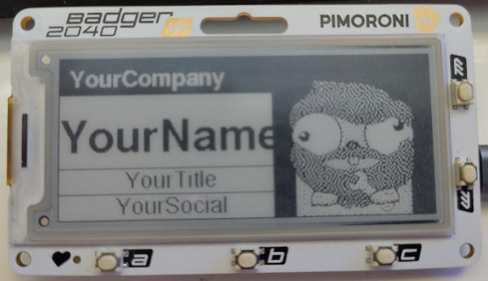

# Badger2040

## Getting Started

Go to the [tutorial](./tutorial/basics) and follow instructions.

## Customizing the badge

The firmware on this repo accept 5 variables while building/flashing it that are later show on the *profile badge*:

* YourCompany
* YourName
* YourTitle
* YourSocial
* ProfilePic 

For **ProfilePic** you need to use a 128x128 black&white picture in base64 format. You could get your gopher profile from [Gopherize.me](https://gopherize.me/) and the [gopherbadgeimg](https://github.com/conejoninja/badger2040/tree/main/cmd/gopherbadgeimg) tool from this repo, it can be scaled and *dithered*.

The data will be shown as follows:




Example:

```bash
tinygo flash --target=badger2040-w -ldflags="-X main.YourName='YourName' \
-X main.YourCompany='YourCompany' \
-X main.YourTitle='YourTitle' \
-X main.YourSocial='YourSocial' \
-X main.ProfilePic='/////////////////////////////////////////////////////////////////////////////////////////////////////////////////////////////////////////////////////////////////////////////////////////////////////////////////////////////////////////////////////////////////////////////////////////////////////////////////////////////////////////////////////////////////////////////////////////////////////////////////////////////////////////////////////////////////////83f///////////////////2Zl//////////////////tjuaPt////////////////nb79Zsf//////////////P3Gx5r7P/////////////9me3r7Odv/////////////p7tezd7N////////////9uWt3bbe9b////////////bd22W24zan///////////vnna+2z3b4///////////+2Otutve3Xz//////////5t9u2Ns222ff/////////+23dbdt3u243/////////+7bt23bdm3v2//////////22mbbts3dsd/////////+NbZ7dm259t5m/////////623m13dtjbuef////////nu2e3Xtt/bM59p///////t2259tntp293mbn//////5nNuVu3du7bd+7Zf/////5uds/bf5tZu55u13/////+777+/cnt2bb3s3e//////7mrZ2e+drfdud247/////23bb9+99u2bc92z1/////9bt3u22+7b7b+23d3////+273fu3ZrWm3t7t3v/////+/eAG+3u3ffbdtmM/////154AAN7e7t9t53e93/////X4AAAz53vjvb7Zve/////uYAAADL3bPue732c/////28AAAAY7t/t+52Pd9/////8AAAADBu2722WA+9/////lAAAAAQHe3tveAGbf////3gAAAAGYdvt8+ABnf/////oAAAAAwhu954AA/d/////sAAAAAMADp7gABH7f////9AAAAABEgAIAAAT5v/////gAAAAAYCRGAAAP+N/////4AAAAAGEBBgAAB/gf////+AAAAAAgSCYAAAf4H/////gfAAAAIgIEAAAD4A/////wJ4AAADiQnAAAAAAP////8EPAAAAgBAYAAAAAD/////BjwAAAIkEkAAAAAA/////w/4AAADgQHAAAAAAP////+H+AAAAhBIYAAAAAD/////A/gAAAIEAkAAAAAI/////4HwAAAGISBgAAAAGf/////AAAAABg9J4AAAAHX/////8AAAAARf8CAAAAHd/////5gAAAAEPfIwAAAGT//////sAAAADHt4cAAABnb/////ZgAAAAh7fBgAAAXb/////5vAAAAbvu+YAAAN2/////77oAAAPc/r9AAAC7f/////zfgAAc3bNjeAAA5t/////nZMAA5zttXN4AA13v/////btwAztm3d+zAA3db////927bB3b3bbjLcA2Z7/////m3a/mbN27Pe2417rv/////t2yZu9n/922/2ze3////9tm3123vJH7dsW7Z3/////vZtnd2bmRPN99t2X//////btvewADEYAB3t29n/////27bbgiQYECIGNpu//////3ZtukCAWBGIm9vt5/////+2ba5kEg2wADvbbH//////vdtt0QAH5ETmNneZ/////+3bd7xJkAATne3b///////vttXnIBbCLXe7bGf/////9m29m75Nm+1tzu/9/////93tq/rT7X2brHW2N//////3tu5O3bPn8ve3d9//////27bZ9bY/Ad7Xu1vr/////93bd7drzQBnOc3ce//////N22ZbbfPCee5279//////x+272t2+cD7Wdru3/////8Y227bXrbAm253t7//////D923dtmuwO23tb7//////yd22Z23a4btt77u3/////8B227tt3sAttjLt5//////EO9u626fENtve36f/////wZ52btuxgBtt29uP/////9AN79tt0AINtm17x//////ER7nbbdAQRtvt7Bf/////wBO37bZ4AAPbv7AP/////8mB7j22bLuQ7/nCJ//////AIf/326/8QH5AyAf/////xAsF/nuzTgngAMGf/////8GCAAPt3XuTgAJEB//////QJgAA7m3vzgHsYEf/////xARsADvvtmgIACIX/////8GUAAg9tt34ABAwB//////IBBBAt7t7sBAAJE//////wiSAAnvvb/pAASAH/////8AMAhJudexaSZTiJ//////JhlJJ9l87/iRv4A//////wCf9773796/3/yRH/////9IHr/gPrN3o/gIAF//////AQAAABnXbwAAiEg//////yBAAAAHYTgARokBP/////8IEgAAAMAAADAQIB//////AQCAAAAAAAAQZIif/////0BIAAAAAAAIDkAAP/////8QAgAIQAAAIAGJJj//////BiCIQQAEIQEAAACf///////////////////////8='" --stack-size=8kb .
```

## Troubleshooting

### Unable to locate any volume

If you are seeing this error, it means that the device needs to be reset:
```
unable to locate any volume: [RPI-RP2]
```
When the device is connected to your computer, press both the `BOOTSEL` button
on the board, and the `reset` button (both are located in the back of the badge)
for 5 seconds, then release the `reset` button first while still holding the
boot for another 5 seconds to reset the device and allow tinygo to flash the
device.

The device might disconnect after being flashed, you need to reset it each time
before flashing it (e.g., for each step of the activity).

If the problem persists, try holding `BOOTSEL` while connecting the USB cable
to your computer. This puts the device in [USB mass storage device mode](https://projects.raspberrypi.org/en/projects/getting-started-with-the-pico/3).

```console
$ fdisk -l
...
Device     Boot Start    End Sectors  Size Id Type
/dev/sdb1           1 262143  262143  128M  e W95 FAT16 (LBA)
```

Make note of the device path, which may be different on your system (e.g. `/dev/sda1`).

On Linux, ensure that the device is mounted with a volume name of `RPI-RP2`:

```console
$ mkdir /media/RPI-RP2
$ mount /dev/sdb1 /media/RPI-RP2
```
