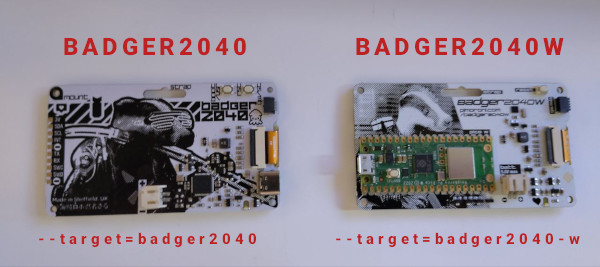
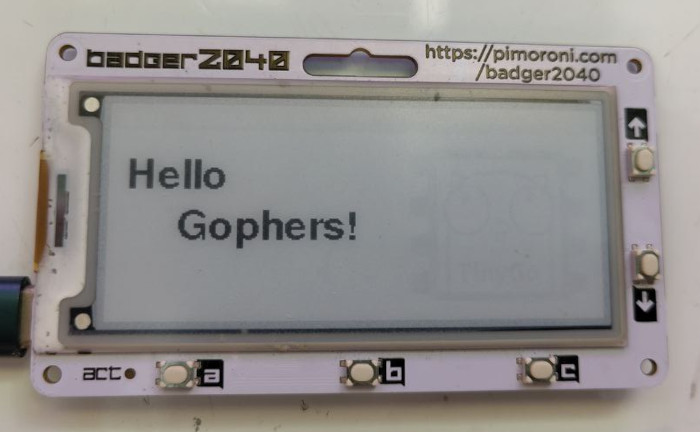
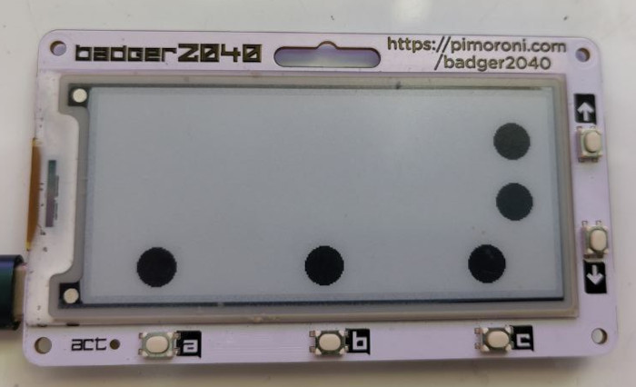

# Badger2040 Tutorial

## What you need

    - Pimoroni Badger2040 or Pimoroni Badger2040W
    - Personal computer with Go 1.22 and TinyGo 0.32 installed, and a serial port.

## Hardware differences

Badger2040 & Badger2040W are a bit different. The **W** in Badger2040**W** is because it has **w**ifi capabilities. Another difference is that Badger2040 has an USB-C connection, while Badger2040W has a micro-USB.

* For the badger2040 you'll need to use ```--target=badger2040``` or ```-target badger2040```
* For the badger2040W you'll need to use ```--target=badger2040-w``` or ```-target badger2040-w```

\*Note: If you are participating in the *GopherCon US TinyGo HackSession* you probably be using the **badger2040w**.

Front side


Back side




## Installation

### Go

If somehow you have not installed Go on your computer already, you can download it here:

https://go.dev/dl/

Now you are ready to install TinyGo.

### TinyGo

Follow the instructions here for your operating system:

https://tinygo.org/getting-started/

## Connecting the Badger2040 to your computer


Plug the Badger2040 into your computer using a USB cable. There may be one provided in your starter kit.


## Running the code

The TinyGo programs will run directly on the Badger2040's microcontroller. The procedure is basically:

- Edit your TinyGo program.
- Compile and flash it to your Badger2040.
- The program executes from the Badger2040. You can disconnect the Badger2040 from your computer (plug it into a battery, if it isn't already), the program executes directly on the microcontroller.

Let's get started!

## Code

### step0.go - Built-in LED

This tests that you can compile and flash your Badger2040 with TinyGo code, by blinking the built-in LED (it's on the back).


```
tinygo flash -target badger2040-w ./tutorial/basics/step0
```

Once the Badger2040 is flashed correctly, the built-in LED (on the back) should start to turn on and off once per second. Now everything is setup correctly and you are ready to continue.


### step1.go - Built-in LED, A Button

Run the code.

```
tinygo flash -target badger2040-w ./tutorial/basics/step1
```

When you press the A button, the built-in LED on the back should turn on.


*Challenge:* 
See if you can modify [./step1/main.go](step1/main.go) so that the LED turns on if
the _B_ button is pressed instead of the _A_ button.

### step2.go - Display

Run the code.

```
tinygo flash -target badger2040-w ./tutorial/basics/step2/
```

The message "Hello Gophers!" should appear on the display.




### step3.go - Display, Buttons

Run the code.

```
tinygo flash -target badger2040-w ./tutorial/basics/step3/
```




The display will show some blue circle that represent that buttons on the board.
When a button is pressed a ring will be shown around its corresponding circle.


### step4.go - Buttons, USB midi interface

Run the code.

```
tinygo flash -target badger2040-w ./tutorial/basics/step4
```

Go to any online midi player with USB capabilities, like [VirtualPiano.eu](https://virtualpiano.eu/). Make sure the Badger2040 MIDI is enabled (this website works better in Chrome, other browsers might not detect the Badger2040 as a MIDI device). It should identify itself as _"Badger Drum"_.
Press the buttons and create your melody.


### step5.go - Buttons, USB HID interface

Run the code.

```
tinygo flash -target badger2040-w ./tutorial/basics/step5
```

Your Badger2040, connected to a computer, will act as a mouse now. Pressing the A&C buttons will move the cursor horizontally, while up&down arrows vertically. B button will perform a left click.

Good job in completing the basic tutorials. Now can check out the examples!


## Next steps & ideas
                              
For example:

- Add new effects and animations to the badge code, like Multipass from _The fifth element_ movie.
- Create your own Rubber Duck attack (examples/rubber-duck).


# Not powering up with battery connected
While powered by battery, the badger need _*one click*_ on any button to get out of low power mode and start running the code.
